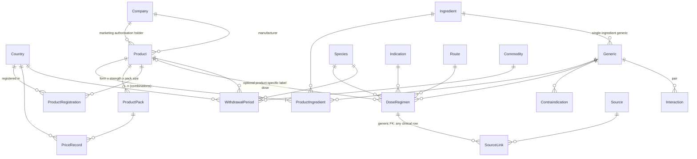

# Data Model (ERD, v0)

Conventions: every table has `id`, `created_at`, `updated_at`; publishable entities add `slug` (unique), `review_status`, `verified_at`. `country`/`species`/`unit` are rows, never enums in code.

## Pharma core
- **Generic**: name, drug_class, synonyms (separate `GenericSynonym` table for search).
- **Ingredient**: substance (INN-like name, CAS optional). A Generic maps to one or more Ingredients so combinations (e.g. amoxicillin + clavulanate) are modeled, not hacked.
- **Product** (brand): brand_name, manufacturer FK Company, MAH FK Company, product_category, is_biologic. Unique `(company, normalized_brand_name)` to block duplicates.
- **ProductIngredient**: product, ingredient, strength_value, strength_unit (FK Unit), per_unit (e.g. per mL, per tablet).
- **ProductPack**: product, dosage_form FK, pack_size_value, pack_size_unit, GTIN optional. Prices attach here, not to Product.
- **ProductRegistration**: product, country, reg_number, status, dates, source. This is the country-availability table; unique `(country, reg_number)`.
- **Company**: name, normalized_name, `CompanyAlias`, roles (manufacturer/importer/distributor), country, verified flag.

## Clinical (all sourced, versioned, review-gated)
- **DoseRegimen**: generic, product? (label-specific), species, indication, route, dose_min/dose_max (Decimal), dose_unit (Unit, e.g. mg/kg), frequency (structured: interval_hours or times_per_day), duration_min/max + duration_unit, max_dose + unit, country? (null = general reference), notes. CHECK: `dose_min <= dose_max`, positive values.
- **WithdrawalPeriod**: product, country, species, commodity, route, value + unit(hours/days), regimen_note, regulatory_status. Unique `(product, country, species, commodity, route)`. Never stored on Generic.
- **Indication, Route, Commodity, Species**: lookup tables. Species has parent for grouping (poultry > broiler/layer).
- **Contraindication / Precaution / AdverseEffect / Interaction**: per generic, optional species; Interaction stores an ordered pair with CHECK `a_id < b_id`.
- **Unit**: code, dimension (mass, volume, concentration, dose-rate, time, ...), factor to canonical unit. Conversion only through this table.

## Provenance & governance
- **Source**: type, title, publisher, authors, url, doi, country, publication_date, accessed_date, edition, page, license_note, checksum.
- **SourceLink**: generic relation (content_type, object_id) -> Source with locator (page/section/quote). Publishing rule: clinical row needs >= 1 SourceLink.
- **Revision history** on all clinical tables; **AuditLog**(actor, action, object, before, after, at).
- **ReviewStatus** values: `community_submitted`, `needs_verification`, `source_found_pending_review`, `manufacturer_supplied`, `official_regulatory`, `expert_reviewed`, `verified`, `deprecated`, `archived`. Public display allowed only for the last-6 minus archived/deprecated (see governance doc).

## Pricing
- **PriceRecord**: product_pack, country, region, city, currency (ISO 4217), price_type, amount Decimal, source, verified_at, submitted_by, confidence. Append-only; history = query by date. **PriceSubmission** goes to moderation before becoming a PriceRecord.

## Ingestion
- **IngestionRun**, **RawDocument**(url, fetched_at, checksum, storage ref, license note), **StagedRecord**(entity_type, payload JSON, matched_entity, confidence, status), **ReviewTask**.

## Later phases (sketched only)
Education: Subject > Topic > Question(+Options, Explanation, source), PastPaper, Exam, ExamAttempt. Opportunities: Job, Scholarship (source_url required, deadline drives status). Users: Bookmark, SavedCalculation, MedicationSchedule.

## Open modeling questions
1. Whether DoseRegimen is per-generic with optional product override, or two tables (reference dose vs label dose). Leaning one table with nullable `product`.
2. Vaccines/biologics: separate `Biologic` extension of Product in Phase 6.
